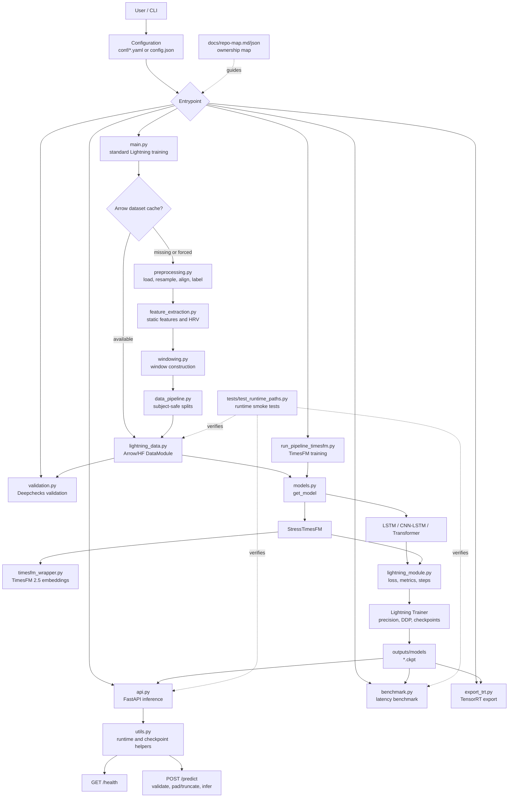

# StressProject

StressProject is a physiological time-series machine learning project for
stress detection. It supports end-to-end preprocessing, subject-safe dataset
splitting, PyTorch Lightning training, TimesFM 2.5 foundation-model experiments,
FastAPI inference, benchmarking, TensorRT export, validation, and repository
governance tooling.

The root repository owns the stress-prediction pipeline. The `timesfm/`
directory is a packaged TimesFM workspace with its own guidance and should be
treated as a separate subproject when making changes under that tree.

## Capabilities

- **Signal processing pipeline**: load physiological signals, resample and align
  channels, extract static features, build time-series windows, and generate
  train/validation/test splits without subject leakage.
- **Dataset conversion**: convert processed arrays into Arrow/Hugging Face
  datasets for repeatable training and faster reloads.
- **Model training**: train LSTM, CNN-LSTM, Transformer, and TimesFM-backed
  stress classifiers with PyTorch Lightning.
- **Experiment tuning**: run tuning helpers for model and training-parameter
  sweeps while keeping the canonical Hydra and JSON configs as the source of
  runtime defaults.
- **Runtime optimization**: detect CUDA, precision, TF32, TensorRT, and
  Torch-TensorRT availability through shared runtime utilities.
- **Inference service**: serve trained checkpoints through a FastAPI API with
  health reporting, input validation, checkpoint loading, sequence
  pad/truncate handling, and preallocated inference buffers.
- **Interactive analysis utilities**: use the dashboard, visualization, and
  notebook surfaces for inspection, calibration, and result exploration.
- **Foundation-model path**: run dedicated TimesFM 2.5 training through
  `run_pipeline_timesfm.py` and `timesfm_wrapper.py`.
- **Validation and benchmarking**: run Deepchecks integrity checks, latency
  benchmarks, TensorRT export, and runtime smoke tests.
- **Model evaluation**: compute classification metrics, compare experiment
  outputs, and keep diagnostics separate from training entrypoints.
- **Repository intelligence**: use `docs/repo-map.md`, `docs/repo-map.json`,
  AGENTS guidance, and GitNexus to navigate ownership and impact safely.

## Application Features

StressProject is organized as a research-to-runtime application rather than a
single training script. The core app features are:

- **End-to-end stress prediction workflow**: raw physiological signals flow
  through preprocessing, feature extraction, windowing, subject-safe splitting,
  model training, checkpoint selection, inference, and diagnostics.
- **Physiological signal support**: pipeline modules are structured around
  wearable-style time-series inputs such as EDA, BVP, ACC, TEMP, respiration,
  labels, and derived static or HRV-style features.
- **Subject-safe evaluation**: split utilities keep subject boundaries intact
  so validation and test metrics are not inflated by subject leakage.
- **Multiple model families**: the training stack supports recurrent,
  convolutional-recurrent, Transformer, and TimesFM-backed classifiers through
  the shared model factory.
- **Foundation-model experimentation**: TimesFM 2.5 integration is isolated
  behind `timesfm_wrapper.py`, with the packaged `timesfm/` project treated as
  its own subproject.
- **FastAPI runtime**: the API exposes health and prediction endpoints, loads
  the best available checkpoint, validates request shape, normalizes sequence
  length, and returns probability, class label, and confidence.
- **Hardware-aware execution**: shared utilities detect CUDA and precision
  capabilities, allow TF32 where available, and keep CPU fallback viable for
  smoke tests and local debugging.
- **Production-oriented export path**: TensorRT export and latency benchmarks
  provide a path from research checkpoints to optimized inference artifacts.
- **Validation and observability surfaces**: Deepchecks validation, evaluation
  helpers, visualization utilities, calibration notebooks, logs, and benchmark
  outputs support model-quality review.
- **Governed repository navigation**: the repo map and GitNexus index define
  ownership, dependencies, execution flows, and change-impact expectations.

## Architecture



## Project Structure

```text
.
|-- conf/                       # Hydra configuration groups
|   |-- config.yaml             # Main config composition
|   |-- dataset/wesad.yaml      # Dataset metadata and sampling rates
|   |-- model/*.yaml            # Model-specific settings
|   |-- processing/default.yaml # Preprocessing/windowing settings
|   `-- training/standard.yaml  # Training settings
|-- docs/
|   |-- repo-map.md             # Canonical repo ownership and dependency map
|   |-- repo-map.json           # Machine-readable repo map
|   `-- repo-map-refresh.ps1    # Map refresh helper
|-- tests/
|   `-- test_runtime_paths.py   # DataModule/API/benchmark smoke tests
|-- timesfm/                    # Packaged TimesFM project and local source
|-- main.py                     # Primary Lightning training entrypoint
|-- run_pipeline.py             # Legacy/alternate training pipeline
|-- run_pipeline_timesfm.py     # TimesFM 2.5 training pipeline
|-- run_lightning.py            # Lightning run helper
|-- api.py                      # FastAPI inference server
|-- benchmark.py                # Runtime latency benchmark
|-- export_trt.py               # TensorRT export helper
|-- validation.py               # Deepchecks integrity validation
|-- data_loader.py              # Raw data loading
|-- preprocessing.py            # Preprocessing orchestration
|-- signal_processing.py        # Resampling and alignment
|-- feature_extraction.py       # Static feature and HRV extraction
|-- windowing.py                # Time-series window construction
|-- data_pipeline.py            # Splits, sampling, DataLoader construction
|-- lightning_data.py           # LightningDataModule
|-- lightning_module.py         # LightningModule wrapper
|-- models.py                   # Model architectures and factory
|-- timesfm_wrapper.py          # TimesFM backbone loader and extractor
|-- utils.py                    # Config, runtime, checkpoint utilities
|-- config.json                 # Legacy/runtime JSON config
`-- requirements.txt            # Python dependencies
```

Runtime and experiment artifacts are not source-of-truth by default:
`outputs/`, `scratch/`, `.venv/`, and `__pycache__/`.

## Installation

```powershell
python -m venv .venv
.\.venv\Scripts\Activate.ps1
pip install -r requirements.txt
```

For CUDA acceleration, install the PyTorch build that matches the local CUDA
runtime before installing project dependencies. TensorRT export additionally
requires `tensorrt` and `torch-tensorrt`.

## Configuration

The project has two configuration surfaces:

- `conf/config.yaml` composes the main Hydra configuration for dataset,
  processing, model, and training settings.
- `config.json` keeps legacy and runtime defaults used by the API and utility
  scripts.

Key settings to verify before a run:

- Dataset path, subject IDs, sampling rates, and channel names in
  `conf/dataset/wesad.yaml`.
- Window size, stride, resampling behavior, and preprocessing controls in
  `conf/processing/default.yaml`.
- Model type and architecture-specific hyperparameters in `conf/model/*.yaml`.
- Batch size, epochs, precision, accelerator settings, and checkpoint behavior
  in `conf/training/standard.yaml`.
- API/runtime checkpoint and context-length assumptions in `config.json`.

Hydra overrides can be passed on the command line. For example:

```powershell
python main.py model=cnn_lstm training.max_epochs=20
python main.py force_preprocess=True processing.window_size=256
```

## Common Workflows

### Train the Standard Pipeline

```powershell
python main.py
```

Regenerate the Arrow/Hugging Face dataset cache:

```powershell
python main.py force_preprocess=True
```

### Train the TimesFM Pipeline

```powershell
python run_pipeline_timesfm.py
```

### Start the Inference API

```powershell
python api.py
```

Check service health:

```powershell
curl http://localhost:8000/health
```

Submit a prediction request:

```powershell
curl -X POST http://localhost:8000/predict `
  -H "Content-Type: application/json" `
  -d "{\"sequence\": [[0,0,0,0,0,0,0,0]]}"
```

The API loads the newest checkpoint from `outputs/models`, rebuilds the model
from configuration, validates the request, pads or truncates sequences to the
configured context length, and returns stress probability, label, and
confidence.

Primary API surface:

| Endpoint | Method | Purpose |
| --- | --- | --- |
| `/health` | `GET` | Reports API readiness and model/checkpoint health. |
| `/predict` | `POST` | Runs stress prediction for one physiological sequence. |

Prediction requests should provide a numeric two-dimensional `sequence` array:

```json
{
  "sequence": [
    [0.1, 0.2, 0.0, 0.5, 36.7, 0.3, 0.2, 0.1]
  ]
}
```

Prediction responses include the model probability, binary stress label, and
confidence score. Invalid shapes or non-numeric values should be rejected before
model execution.

### Benchmark, Validate, and Export

```powershell
python benchmark.py
python validation.py
python export_trt.py --ckpt outputs/models/best_model.ckpt
```

Additional app and experiment utilities:

```powershell
python evaluation.py
python visualization.py
python tuning.py
python dashboard.py
python convert_to_hf.py
```

Use these only when their input artifacts exist. In particular, visualization,
dashboard, and evaluation paths usually expect completed training outputs,
processed datasets, or saved checkpoints.

### Run Tests

```powershell
python -m pytest tests/test_runtime_paths.py
```

The runtime smoke tests cover Lightning batch handling, Arrow-backed
DataModule batches, API initialization and prediction on CPU, and benchmark
execution.

## Outputs and Artifacts

Generated artifacts are intentionally separated from source files:

| Path | Contents |
| --- | --- |
| `outputs/models/` | Lightning checkpoints and selected model artifacts. |
| `outputs/` | Training logs, metrics, benchmark results, and generated runtime outputs. |
| `scratch/` | Temporary experiments and disposable local work. |
| `.venv/` | Local Python environment. |
| `__pycache__/` | Python bytecode cache. |

Do not treat generated artifacts as source-of-truth unless a task explicitly
targets experiment outputs, model artifacts, or benchmark results.

## Development Notes

- Start broad investigations from `docs/repo-map.md`; it is the canonical
  ownership and dependency map.
- Keep root-level scripts focused on stress-prediction workflows. Changes under
  `timesfm/` follow `timesfm/AGENTS.md` and the packaged TimesFM project
  conventions.
- Run GitNexus impact analysis before editing functions, classes, or methods.
- Refresh the repo map after structural moves, new source files, or ownership
  changes.
- Prefer focused tests for the touched runtime path before broad experiment
  reruns.

## Useful Docs

| Document | Purpose |
| --- | --- |
| `docs/repo-map.md` | Canonical ownership matrix, source index, and dependency anchors. Start here before broad edits. |
| `docs/repo-map.json` | Machine-readable version of the repo map for automation and tooling. |
| `docs/repo-map-refresh.ps1` | Regenerates the markdown and JSON repo maps after structural file changes. |
| `AGENTS.md` | Top-level agent policy for navigation, ownership, GitNexus use, and repo-map upkeep. |
| `CLAUDE.md` | Parallel top-level assistant guidance for this repository. |
| `timesfm/AGENTS.md` | Additional guidance for the packaged TimesFM subproject. |
| `conf/config.yaml` | Main Hydra config composition. |
| `config.json` | Legacy/runtime JSON config used by API and utility paths. |
| `tests/test_runtime_paths.py` | Minimal runtime verification surface for the main Python paths. |

Refresh the repo map after structural moves or ownership changes:

```powershell
pwsh .\docs\repo-map-refresh.ps1 -RepoRoot (Get-Location).Path
```

GitNexus is configured for this repository. Use it to inspect unfamiliar
execution flows, run impact analysis before symbol edits, and detect affected
flows before committing.
