# StressProject Full Repo Map

Generated on: 2026-05-06T00:00:00-05:00 (UTC-05:00)

## Scope and Use

- This file is the canonical navigation map for all agents in this repo.
- Start here before broad edits or cross-file diagnosis.
- `outputs/`, `scratch/`, `.venv/`, and `__pycache__/` are excluded from ownership decisions unless explicitly requested.
- Use absolute file paths when referencing files in reviews and change notes.

## Machine index refresh

- `docs/repo-map.json` is the canonical machine-readable index derived from this map.
- After ownership edits or file churn, refresh both quickly with:

```powershell
pwsh .\docs\repo-map-refresh.ps1 -RepoRoot (Get-Location).Path
```

This keeps the JSON index aligned with the markdown map for agent automation and tooling.

## Directory Topology

```mermaid
flowchart TD
  R["StressProject"]
  R --> C["conf/"]
  R --> D["docs/"]
  R --> T["timesfm/"]
  R --> DTEST["tests/"]
  R --> ROOT["Root Scripts/Config"]
  R --> META[".devcouncil, .claude, AGENTS/CLAUDE"]

  ROOT --> PIPE["Training + Inference Pipelines"]
  ROOT --> DATA["Data Pipeline"]
  ROOT --> FEAT["Feature Pipeline"]
  ROOT --> EVAL["Eval + Diagnostics"]
  ROOT --> MODELING["Modeling + Lightning"]
  ROOT --> UTIL["Utilities"]

  PIPE --> main["main.py"]
  PIPE --> run_pipeline["run_pipeline.py"]
  PIPE --> run_pipeline_timesfm["run_pipeline_timesfm.py"]
  PIPE --> run_lightning["run_lightning.py"]
  PIPE --> tuning["tuning.py"]

  DATA --> data_loader["data_loader.py"]
  DATA --> data_pipeline["data_pipeline.py"]
  DATA --> data_splitting["data_splitting.py"]
  DATA --> preprocessing["preprocessing.py"]
  DATA --> windowing["windowing.py"]

  FEAT --> feature_engineering["feature_engineering.py"]
  FEAT --> feature_extraction["feature_extraction.py"]
  FEAT --> signal_processing["signal_processing.py"]
  FEAT --> pytorch_datasets["pytorch_datasets.py"]
  FEAT --> convert_to_hf["convert_to_hf.py"]

  MODELING --> lightning_data["lightning_data.py"]
  MODELING --> lightning_module["lightning_module.py"]
  MODELING --> models["models.py"]
  MODELING --> timesfm_wrapper["timesfm_wrapper.py"]
  MODELING --> training["training.py"]

  EVAL --> api["api.py"]
  EVAL --> benchmark["benchmark.py"]
  EVAL --> evaluation["evaluation.py"]
  EVAL --> validation["validation.py"]
  EVAL --> visualization["visualization.py"]
  EVAL --> losses["losses.py"]
  EVAL --> sampling["sampling.py"]

  UTIL --> utils["utils.py"]
  UTIL --> dashboard["dashboard.py"]
  UTIL --> export["export_trt.py"]
  UTIL --> widget_setup["widget_setup.py"]

  T --> TSRC["timesfm/src/timesfm"]
  T --> V1["timesfm/v1"]
  T --> SK["timesfm/timesfm-forecasting"]
  T --> TDOC["timesfm docs + packaging"]

  TSRC --> tf2p["timesfm_2p5"]
  TSRC --> tflax["flax"]
  TSRC --> ttorch["torch"]
  TSRC --> tutils["utils"]
  TSRC --> cfg["configs.py"]
```



## Full Source/Doc Index (non-runtime artifacts)

### Root
- `.claude/settings.local.json`  
- `.devcouncil/config.yaml`  
- `.devcouncil/state.sqlite`  
- `AGENTS.md`  
- `api.py`  
- `Baseline_Calibration_for_Stress_Response.ipynb`  
- `benchmark.py`  
- `CLAUDE.md`  
- `config.json`  
- `convert_to_hf.py`  
- `cuda_python.ps1`  
- `dashboard.py`  
- `data_loader.py`  
- `data_pipeline.py`  
- `data_splitting.py`  
- `dvc_init.py`  
- `docs/repo-map.md`  
- `evaluation.py`  
- `export_trt.py`  
- `feature_engineering.py`  
- `feature_extraction.py`  
- `gitnexus-analyze.err.log`  
- `gitnexus-analyze.out.log`  
- `lightning_data.py`  
- `lightning_module.py`  
- `losses.py`  
- `main.py`  
- `models.py`  
- `preprocessing.py`  
- `pytest.ini`  
- `pytorch_datasets.py`  
- `README.md`  
- `requirements.txt`  
- `RESUME_STAR_POINTS.md`  
- `run_lightning.py`  
- `run_pipeline.py`  
- `run_pipeline_timesfm.py`  
- `sampling.py`  
- `signal_processing.py`  
- `timesfm_wrapper.py`  
- `training.py`  
- `tuning.py`  
- `utils.py`  
- `validation.py`  
- `visualization.py`  
- `widget_setup.py`  
- `windowing.py`  

### `conf/`
- `conf/config.yaml`  
- `conf/dataset/wesad.yaml`  
- `conf/model/cnn_lstm.yaml`  
- `conf/model/patchtst.yaml`  
- `conf/model/timesfm.yaml`  
- `conf/processing/default.yaml`  
- `conf/training/standard.yaml`  

### `tests/`
- `tests/test_runtime_paths.py`  

### `docs/`
- `docs/repo-map.md`  
- `docs/repo-map.json`  
- `docs/repo-map-refresh.ps1`  
- `docs/assets/logo.png`

### `timesfm/`
- `timesfm/AGENTS.md`  
- `timesfm/.gitattributes`  
- `timesfm/.github/workflows/main.yml`  
- `timesfm/.github/workflows/manual_publish.yml`  
- `timesfm/LICENSE`  
- `timesfm/README.md`  
- `timesfm/pyproject.toml`  
- `timesfm/requirements.txt`  

#### `timesfm/src/timesfm/`
- `timesfm/src/timesfm/__init__.py`  
- `timesfm/src/timesfm/configs.py`  
- `timesfm/src/timesfm/timesfm_2p5/timesfm_2p5_base.py`  
- `timesfm/src/timesfm/timesfm_2p5/timesfm_2p5_flax.py`  
- `timesfm/src/timesfm/timesfm_2p5/timesfm_2p5_torch.py`  
- `timesfm/src/timesfm/flax/__init__.py`  
- `timesfm/src/timesfm/flax/dense.py`  
- `timesfm/src/timesfm/flax/normalization.py`  
- `timesfm/src/timesfm/flax/transformer.py`  
- `timesfm/src/timesfm/flax/util.py`  
- `timesfm/src/timesfm/torch/__init__.py`  
- `timesfm/src/timesfm/torch/dense.py`  
- `timesfm/src/timesfm/torch/normalization.py`  
- `timesfm/src/timesfm/torch/transformer.py`  
- `timesfm/src/timesfm/torch/util.py`  
- `timesfm/src/timesfm/utils/xreg_lib.py`  
- `timesfm/src/timesfm.egg-info/dependency_links.txt`  
- `timesfm/src/timesfm.egg-info/PKG-INFO`  
- `timesfm/src/timesfm.egg-info/requires.txt`  
- `timesfm/src/timesfm.egg-info/SOURCES.txt`  
- `timesfm/src/timesfm.egg-info/top_level.txt`  

#### `timesfm/v1/`
- `timesfm/v1/README.md`  
- `timesfm/v1/TROUBLESHOOTING.md`  
- `timesfm/v1/LICENSE`  
- `timesfm/v1/docs/contributing.md`  
- `timesfm/v1/poetry.lock`  
- `timesfm/v1/pyproject.toml`  

#### `timesfm/v1/experiments/baselines/`
- `timesfm/v1/experiments/baselines/__init__.py`  
- `timesfm/v1/experiments/baselines/timegpt_pipeline.py`  

#### `timesfm/v1/experiments/extended_benchmarks/`
- `timesfm/v1/experiments/extended_benchmarks/README.md`  
- `timesfm/v1/experiments/extended_benchmarks/run_timegpt.py`  
- `timesfm/v1/experiments/extended_benchmarks/run_timesfm.py`  
- `timesfm/v1/experiments/extended_benchmarks/tfm_extended_new.png`  
- `timesfm/v1/experiments/extended_benchmarks/tfm_results.png`  
- `timesfm/v1/experiments/extended_benchmarks/utils.py`  

#### `timesfm/v1/experiments/long_horizon_benchmarks/`
- `timesfm/v1/experiments/long_horizon_benchmarks/README.md`  
- `timesfm/v1/experiments/long_horizon_benchmarks/run_eval.py`  
- `timesfm/v1/experiments/long_horizon_benchmarks/tfm_long_horizon.png`  

#### `timesfm/v1/notebooks/`
- `timesfm/v1/notebooks/covariates.ipynb`  
- `timesfm/v1/notebooks/finetuning.ipynb`  
- `timesfm/v1/notebooks/finetuning_torch.ipynb`  

#### `timesfm/v1/peft/`
- `timesfm/v1/peft/README.md`  
- `timesfm/v1/peft/finetune.py`  
- `timesfm/v1/peft/finetune.sh`  
- `timesfm/v1/peft/usage.ipynb`  

#### `timesfm/v1/src/adapter/`
- `timesfm/v1/src/adapter/__init__.py`  
- `timesfm/v1/src/adapter/dora_layers.py`  
- `timesfm/v1/src/adapter/lora_layers.py`  
- `timesfm/v1/src/adapter/utils.py`  

#### `timesfm/v1/src/finetuning/`
- `timesfm/v1/src/finetuning/__init__.py`  
- `timesfm/v1/src/finetuning/finetuning_example.py`  
- `timesfm/v1/src/finetuning/finetuning_torch.py`  

#### `timesfm/v1/src/timesfm/`
- `timesfm/v1/src/timesfm/__init__.py`  
- `timesfm/v1/src/timesfm/data_loader.py`  
- `timesfm/v1/src/timesfm/patched_decoder.py`  
- `timesfm/v1/src/timesfm/pytorch_patched_decoder.py`  
- `timesfm/v1/src/timesfm/time_features.py`  
- `timesfm/v1/src/timesfm/timesfm_base.py`  
- `timesfm/v1/src/timesfm/timesfm_jax.py`  
- `timesfm/v1/src/timesfm/timesfm_torch.py`  
- `timesfm/v1/src/timesfm/xreg_lib.py`  

#### `timesfm/v1/tests/`
- `timesfm/v1/tests/test_timesfm.py`  

#### `timesfm/timesfm-forecasting/`
- `timesfm/timesfm-forecasting/SKILL.md`  
- `timesfm/timesfm-forecasting/references/api_reference.md`  
- `timesfm/timesfm-forecasting/references/data_preparation.md`  
- `timesfm/timesfm-forecasting/references/system_requirements.md`  
- `timesfm/timesfm-forecasting/scripts/check_system.py`  
- `timesfm/timesfm-forecasting/scripts/forecast_csv.py`  

#### `timesfm/timesfm-forecasting/examples/anomaly-detection/`
- `timesfm/timesfm-forecasting/examples/anomaly-detection/detect_anomalies.py`  

#### `timesfm/timesfm-forecasting/examples/covariates-forecasting/`
- `timesfm/timesfm-forecasting/examples/covariates-forecasting/demo_covariates.py`  

#### `timesfm/timesfm-forecasting/examples/global-temperature/`
- `timesfm/timesfm-forecasting/examples/global-temperature/generate_animation_data.py`  
- `timesfm/timesfm-forecasting/examples/global-temperature/generate_gif.py`  
- `timesfm/timesfm-forecasting/examples/global-temperature/generate_html.py`  
- `timesfm/timesfm-forecasting/examples/global-temperature/README.md`  
- `timesfm/timesfm-forecasting/examples/global-temperature/run_example.sh`  
- `timesfm/timesfm-forecasting/examples/global-temperature/run_forecast.py`  
- `timesfm/timesfm-forecasting/examples/global-temperature/temperature_anomaly.csv`  
- `timesfm/timesfm-forecasting/examples/global-temperature/visualize_forecast.py`  

### Ownership Matrix

- **Data ingestion / dataset construction**
  - `data_loader.py`, `data_pipeline.py`, `data_splitting.py`, `preprocessing.py`, `windowing.py`, `conf/**`
- **Feature engineering / signal processing**
  - `feature_engineering.py`, `feature_extraction.py`, `signal_processing.py`, `utils.py`, `pytorch_datasets.py`
- **Modeling / training**
  - `main.py`, `models.py`, `run_pipeline.py`, `run_pipeline_timesfm.py`, `run_lightning.py`, `training.py`, `tuning.py`, `timesfm_wrapper.py`, `lightning_data.py`, `lightning_module.py`
- **Evaluation / inference / diagnostics**
  - `api.py`, `evaluation.py`, `validation.py`, `benchmark.py`, `sampling.py`, `visualization.py`, `losses.py`, `export_trt.py`
- **Documentation**
  - `README.md`, `docs/**`
- **Tests**
  - `tests/**`
- **Project governance / meta**
  - `AGENTS.md`, `CLAUDE.md`, `.claude/**`, `.devcouncil/**`, `RESUME_STAR_POINTS.md`
- **Shared utilities / orchestration**
  - `config.json`, `cuda_python.ps1`, `convert_to_hf.py`, `dashboard.py`, `dvc_init.py`, `widget_setup.py`, `Baseline_Calibration_for_Stress_Response.ipynb`, `gitnexus-analyze.err.log`, `gitnexus-analyze.out.log`, `pytest.ini`, `requirements.txt`
- **TimesFM package / packaging**
  - `timesfm/AGENTS.md`, `timesfm/README.md`, `timesfm/pyproject.toml`, `timesfm/src/timesfm/**`, `timesfm/timesfm-forecasting/SKILL.md`, `timesfm/timesfm-forecasting/references/**`, `timesfm/timesfm-forecasting/scripts/**`, `timesfm/.gitattributes`, `timesfm/.github/**`, `timesfm/LICENSE`, `timesfm/requirements.txt`
- **Legacy / archive**
  - `timesfm/v1/**`, `timesfm/timesfm-forecasting/examples/**`

### Call/Dependency anchors

- High coupling (in/out import graph, source-focused): `utils.py`, `models.py`, `preprocessing.py`, `data_pipeline.py`, `training.py`, `lightning_module.py`, `run_pipeline_timesfm.py`
- `main.py` owner-critical path: `utils` → `data pipeline` → `models.get_model` → `lightning_module` → `L.Trainer.fit` (and `run_pipeline_timesfm.py` similar path for full training).
- Inference API flow: `api.py` startup `load_best_model` → `initialize_model_state` → `get_model`/checkpoint load → `/predict`.
